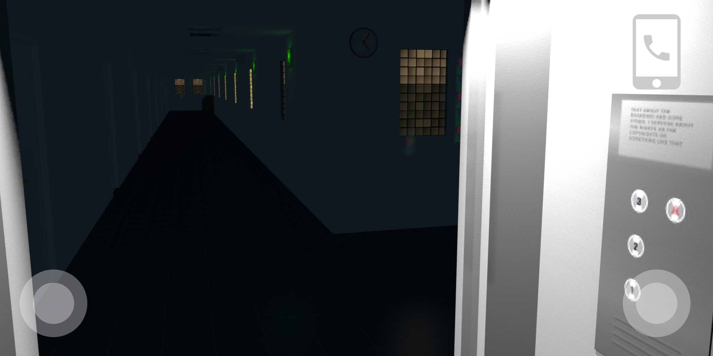
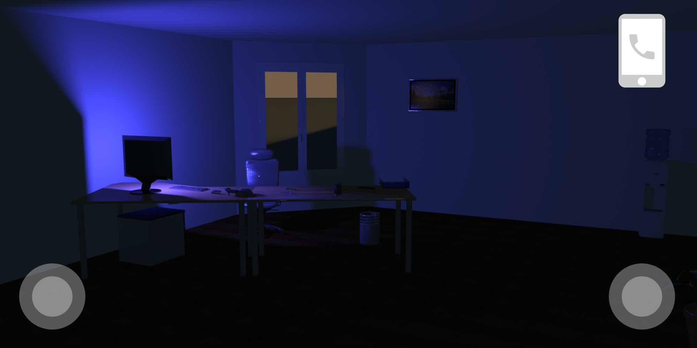
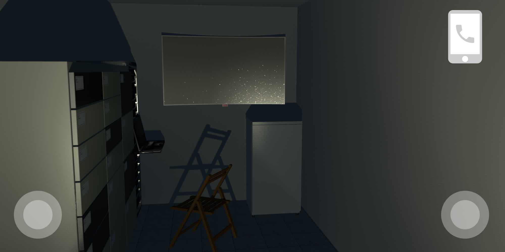

# Infosec Game – Physical Pen-test simulator

[Premiers tests sur le serveur en production - version "haute définition" - Attention - ne marche pas sur un Meta Quest 2](https://error-cezar.github.io/VR-Project/gametest.html)

[Premiers tests sur le serveur en production - version "faible définition" - utilisable sur un Meta Quest 2](https://error-cezar.github.io/VR-Project/gametest-low.html)

>Attention: les fichiers obj composant la scène à charger sont volumineux. Il y a un temps de chargement non négligeable en attente d'optimisation. Pour la navigation, il faut cliquer sur le sol pour s'y rendre. Pour l'instant, les objets ne sont pas implémentés, mais la zone est visitable. Il manque encore les lumières dans les bureaux.

`Note: Il y a beaucoup de boulot pour l'ambiance et les lumières à faire sur la page A-Frame.... Le but est de coller autant que possible à l'image ci-dessus (ambiance obscure, inquiétante, cadre réaliste). Manque aussi 4 zones pour limiter les déplacements du joueur en fonction des phases de jeux : (1) Zone ascenseur (Début et Fin de jeu) | (2) Zone couloir | (3) Zone bureau 642 | (4) Zone 641A`

## Objectif du projet
Créer une application Web en 3D, exploitable sur différentes plate formes (PC, smartphones, casques VR) sans nécessiter de téléchargement d'applications tierces pour sensibiliser à la sécurité de l'information. Si le scénario concerne le cas d'une entreprise, les différents éléments soulevés doivent pouvoir s'appliquer au grand public. Pour être utilisée, seul un navigateur compatible doit être  nécéssaire, et aucun cookie ou traceur ne sera déployé. L'expérience doit être la plus ludique possible, afin d'optimiser sa dimension pédagogique. Elle doit inclure de multiples références à des risques ou des faits relatifs à la sécurité de l'information dans ses aspects techniques ou normatifs permettant de devenir un support pédagogique exploitable dans un cadre plus large. Le niveau requis pour la compréhension de l'ensemble des concepts par un joueur est la première année de lycée en Bac Pro CIEL. Le jeu doit être proposé et utilisable en deux langues, anglais et français.
Le principe du jeu est de type jeu d'aventure avec "objets cachés" (par exemple, cliquer sur une clef USB qui traine sur un bureau pour identifier un risque), avec une application pédagogique (après avoir trouvé la clef, le joueur à la possibilité d'interragir avec un employé au téléphone qui lui explique les risques et menaces que cette situation génère). Il se conclue avec des suggestions de remédiations.

Le support, le scénario, le code et tous les éléments graphiques doivent être [sous licence AFFERO GPL v3](https://fr.wikipedia.org/wiki/GNU_Affero_General_Public_License).

## Auteurs
- Matthieu Farcot
- Yanis Maafa (élève de terminale en Bac PRO SSIHT, stagiaire)

## Cadre
Le joueur est employé dans une société de sécurité de l’information nommée **Explicitely Identifiable** ("Ei"). Cette société propose de multiples services dont la réalisation d'audits en vue de l'obtention d'une [certification ISO/CEI 27000](https://fr.wikipedia.org/wiki/ISO/CEI_27000). Dans le cadre de ce processus de certification abordant la gestion de la sécurité de l'information et la mise en oeuvre des bonnes pratiques liées, le joueur va réaliser un "Pentest physique" au sein d'une société virtuelle cliente nommée **TBO** (pour The Big One). Par "Pentest physique", il est entendu une tentative d’intrusion et une identification systématique des risques associés à la sécurité de l’information, en complément des tests réalisés sur l’infrastructure informatique qui ne seront pas abordés directement dans le jeu (mais auquel il sera fait mention à de multiples occasions). L’opération est réalisée et menée avec la pleine coopération et sur commande du PDG et du conseil d'administration de TBO, mais pour que l’audit soit efficace, les employés n’ont pas été prévenus.

Il va être demandé au joueur de se concentrer sur les activités et les pratiques en matière de sécurité de l'information d'un employé précis, le directeur de la branche marketing de la société TBO qui vient de partir pour 2 semaines en vacances. Dans le cadre de sa progression, le joueur va vite réaliser que de nombreuses mauvaises pratiques sont mises en oeuvre. Afin de rendre l'aventure plus ludique, le joueur aura aussi l'occasion de trouver des détails personnels sur la vie de ce directeur. A chaque découverte, le joueur va être mis en relation par téléphone avec un employé de EI qui suit les activités du joueur via une caméra embarquée.
Ces interventions seront l'occasion de caractériser les risques concernés.

Un easter-egg permettra d'élargir la problématique s'il est découvert. TBO possède en effet une pièce cachée dédiée à l'écoute et la surveillance pour le compte d'une agence gouvernementale (ou organisme privé type NSO Group?). Toute ressemblance avec des faits existants ou [ayant existé](https://fr.wikipedia.org/wiki/Room_641A) serait presque purement fortuite.

A la fin du jeu, le joueur a accès à ses statistiques de réalisation et se voit décerner des badges en fonction de ses actions. Ces badges seront l'occasion de revenir sur les bonnes pratiques.

## Plan du jeu

Le plan est simple. A l'ouest, un ascenseur par lequel arrive et repart le joueur. A l'est, deux bureaux. Le plus à droite (numéro 642) est le bureau du directeur. Juste avant une porte permet de rentrer dans un petit bureau sans fenêtre identifié par le numéro 641A.

## Interface
Le jeu se déroule en temps réel, dans un environnement 3D. Sur l’écran de jeu, il y a la représentation d’un téléphone portable. Lorsqu’il y a un appel, le pictogramme change de couleur et un bruit de buzzer survient, invitant le joueur à décrocher. Si le joueur clique dessus, il voit un employé lui parler en vidéo (affichage plein écran du téléphone si navigation sur un écran ou rattaché à une manette en VR). Note: Le jeu peut se faire sans jamais décrocher le téléphone.

## Histoire

### Introduction

Cette partie introductive est un support.
> ***La sécurité de l'information***
>
>Le concept de **sécurité informatique** (*Cybersécurité*) se concentre sur la *protection du matériel informatique* utilisé pour créer ou diffuser de l'information sous forme numérique, du poste final aux infrastructures réseaux en passant par les serveurs et tous les équipements connectés. La **sécurité de l'information** va *au-delà* en incluant la problématique de la protection de l'information dans l'ensemble d'une organisation, donc en lien avec les employés et la manière dont ils travaillent, même sans ordinateur. La sécurité de l'information touche la manière de faire, la manière de penser, et tout ce qui fait la *particularité* d'une entreprise ou organisation. En ce sens, la cybersécurité est un sous-ensemble de la sécurité de l'information, car la sécurité de l'information va bien au-delà des problématiques technologiques. Il s'agit de protéger ce qui fait la valeur dans une organisation - l'information - sous toutes ses formes. Certaines informations sont stratégiques, comme une manière de faire spécifique qui est reconnue sur un marché, et ne doivent pas être partagées. D'autres, comme des contrats, ne peuvent être signées ou validées que par certains individus en rapport avec la hiérarchie.
>
>En sécurité de l'information, il y a 3 aspects fondamentaux à protéger dans une organisation :
>
>-	la confidentialité : la confidentialité est essentielle pour préserver la confiance des utilisateurs et des clients. Les fuites de données peuvent entraîner des conséquences graves, tant sur le plan financier que sur la réputation d’une organisation (la sécurité de l’information vise à protéger les données sensibles et confidentielles contre les accès non autorisés. Cela inclut par exemple les informations personnelles, les secrets commerciaux et les données financières).
>-	l'intégrité : la sécurité de l’information cherche à garantir que les données restent intactes et non altérées. Elle empêche les manipulations malveillantes ou les modifications non autorisées.
>-	la disponibilité : les attaques informatiques peuvent perturber les services essentiels. La sécurité de l’information vise à maintenir la disponibilité des systèmes et des données, même en cas d’incident.
>
>En plus peut se rajouter la conformité réglementaire : de nombreuses lois et réglementations exigent que les entreprises protègent les données de leurs clients. La sécurité de l’information permet de respecter ces obligations légales.
>
>Une organisation qui veut sécuriser ses informations doit donc inclure dans ses manières de fonctionner l'idée clef de la sécurité. Cela souvent signifie qu'elle doit rendre disponible à tous ses employés un règlement clair sur la manière dont l'information est gérée, qu'elle soit numérique, écrite de manière manuscrite ou encore orale. Ces règles sont regroupées dans un document qui s'appelle une **politique de sécurité** et qui dicte ce qu'un employé peut et doit faire afin de protéger au mieux les information dans une organisation.
>
>### La politique de sécurité
>
>La politique de sécurité des systèmes d’information (PSSI) est un document essentiel qui définit les principes et les règles de sécurité au sein d’une organisation. Elle joue un rôle central dans la stratégie de cybersécurité et assure la cohérence entre les différents services lorsqu’ils traitent des menaces ou des incidents similaires. Elle influence de nombreux facteurs, comme :
>
>- Cohérence et Confiance : La PSSI fournit un socle commun de mesures face aux risques, suscitant la confiance des collaborateurs et des prestataires vis-à-vis du système d’information. Elle facilite également les collaborations avec l’écosystème de l’entreprise.
>- Gestion des Risques : Une PSSI réussie offre des conseils sur la gestion des risques, la réponse aux menaces, la réalisation d’audits de sécurité, la protection des données et la conformité aux réglementations juridiques.
>- Adaptabilité et Mise à Jour : Face à l’augmentation constante des cyberattaques, il est essentiel de maintenir la PSSI à jour pour rester efficace contre les nouvelles menaces et l’évolution technologique2.
>- Protection Globale : La PSSI contribue à la protection contre la perte de données, le vol et la fraude. Elle réduit les risques d’accès non autorisé aux locaux, aux données et aux systèmes, ainsi que les attaques malveillantes.
>
>
>En somme, élaborer une PSSI est bien plus qu’une formalité administrative ; c’est un investissement crucial pour la sécurité et la pérennité de l’organisation.
>
>Cybersécurité et sécurité de l'information sont étroitement liées. Aucune organisation ne peut sécuriser son infrastructure informatique si les utilisateurs de celle-ci font n'importe quoi. Tout est affaire de risques, et de la manière dont ceux-ci sont gérés. La plus grande difficulté pour les utilisateurs et/ou employés et de changer leur manière de faire lorsque cette manière expose l'organisation à un risque. Mais changer est beaucoup plus facile à dire qu'à faire car un des grands travers des êtres humains est justement... *la résistance au changement*.
>
>### Risque, menace et vulnérabilité
>
>Proches du concept de sécurité et des intérêts des sciences de la sécurité, ces trois concepts méritent une définition distincte :
>
>- Risque. Le risque peut être défini comme la probabilité que, dans une situation donnée et impliquant certains éléments, un dommage se produise. En d’autres termes, par « risque », nous entendons la possibilité qu’un danger se matérialise en dommage. Ainsi, il y a des risques élevés et faibles, et des risques liés au travail, à l’économie, à la santé, etc.
>- Menace. Une menace est, quant à elle, un acteur ou un ensemble de conditions dans lesquelles un risque se manifeste. C’est-à-dire les éléments qui provoquent l’apparition de risques, du fait de leur nature propre, ou d’un rôle qu’ils jouent dans un contexte donné. Une voiture peut être une menace, par exemple, si le conducteur est ivre.
>- Vulnérabilité. Enfin, on parle de vulnérabilité pour désigner une condition ou une situation de propension ou d’impuissance plus ou moins grande face aux risques et aux menaces. Plus vous êtes vulnérable à un risque, plus vous avez de chances de subir des dommages et/ou plus les dommages pouvant être subis sont importants. C’est tout le contraire de la sécurité.
>
>
***Ouverture de la zone Ascenseur***

Le jeu commence dans un ascenseur, occasion d'apprécier une musique dédiée et de faire passer un court générique. Le téléphone sonne à la fin du générique. Si le joueur clique sur le téléphone, un employé de Ei intervient en vidéo.

|Texte français|Texte anglais|
|---|---|
|Bonjour. Je suis TayGPT, votre assistante vocale. Vous êtes attendu au bureau 642. Comme indiqué, votre mission est d’identifier tout risque en matière de sécurité de l’information en lien avec Monsieur Dufront, le directeur marketing de TBO, qui est actuellement en vacances. Les bureaux sont fermés par digicode donc évitez de déclencher l’alarme. |Hello. I am TayGPT, your voice assistant. You are expected in office 642. As indicated, your mission is to identify any information security risk associated with Mr. Dufront, the marketing director of TBO, who is currently on vacation. The offices are closed by a keypad, so avoid triggering the alarm. |

Si le joueur ne clique pas sur le téléphone, lancement de la séquence suivante au bout de 20 secondes.

***Ouverture de la Zone Couloir***

Les portes de l'ascenseur s'ouvrent. Un long couloir bardé de 8 portes se présente au joueur. La seule faible lumière vient de l'extérieur par des fenêtres et des panneaux de sortie d’urgence au plafond. Les panneaux comportent des flèches pointant vers une porte à côté de l’ascenseur. Sur le palier se trouve un extincteur.

Dans le couloir , toutes les portes des bureaux (à l'exception de la sortie de secours) sont fermées par des digicodes. Les numéros de porte défilent alors que le joueur avance. Le premier bureau à la sortie de l'ascenseur est le 636. Ils se suivent jusqu'à une duplication du 641 qui est le 641A. Au milieu du couloir il y a un plan d’évacuation. Tous les bureaux sont identifiés, sauf le 641A, qui semble ne pas exister (la porte n'est pas sur le plan).

### Objet 1 - le document sur l'imprimante
Alors qu’il arrive au fond du couloir, une imprimante laser partagée se trouve le long du mur. Si le joueur s’approche de l’imprimante, il verra une page imprimée, signée par Mr Dufront et datée de la veille. 

Lorsque le joueur clique sur la feuille de l’imprimante, il la prend (affichage plein écran si navigation sur un écran, ou rattaché à une manette en VR).

|Texte français|Texte anglais|
|---|---|
|Confidentiel. À destination du comité de direction. Je suis conscient de l’effet initial que va avoir l’annonce du plan social sur le moral des troupes, mais il n’y a rien de mieux qu’un électrochoc pour motiver les employés. Donc, pour le dégraissage du mammouth, je me propose de vous transmettre une liste de quelques employés qui sont, à mes yeux, dispensables dans mon service. J’en vois trois en particulier : ma secrétaire Isabelle P., le graphiste Thierry A. et le responsable de notre présence en ligne, Albert F. Cela permettra aux 80 % qui resteront de saisir l’occasion et d’arrêter de nous importuner avec le télétravail. Merci en tout cas d'attendre mon retour de vacances avant toute annonce publique, sachant que les syndicats vont sans doute se réveiller. Cordialement, M. Dufront, Directeur Marketing | Confidential. For the attention of the executive committee. I am aware of the initial impact that the announcement of the social plan will have on morale, but there is nothing better than a shock to motivate employees. Therefore, for streamlining the organization, I propose to provide you with a list of a few employees who, in my view, are dispensable in my department. I specifically identify three: my secretary Isabelle P., the graphic designer Thierry A., and the person responsible for our online presence, Albert F. This will allow the remaining 80% to seize the opportunity and stop bothering us with remote work. Thank you, in any case, for waiting until I return from vacation before making any public announcements, as the unions are likely to wake up. Sincerely, Mr. Dufront, Marketing Director|

Après l'avoir lue, lorsqu’il re-clique dessus, la feuille revient à sa place d'origine, et une lumière rouge s’allume au-dessus de la feuille, indiquant qu’un objet a été trouvé (**Objet 1**). Le téléphone sonne.

|Texte français|Texte anglais|
|---|---|
|Nom d’un algorithme ! Laisser traîner un document confidentiel de cette manière est une négligence majeure. Les conséquences pourraient être désastreuses pour l’entreprise et ses employés. Je note la recommandation de mettre en place un contrôle d’accès par badges ou codes sur l’imprimante. |For digitalness sake ! Leaving a confidential document lying around in this way is a major negligence. The consequences could be disastrous for the company and its employees. I note the recommendation to put in place an access control by badges or codes on the printer. |

Après avoir passé l’imprimante, le joueur trouve le bureau numéro 642, porte la plus au fond à gauche.

### Objet 2 - le code sur post-it

Sur la porte, le joueur trouve un post-it.

|Texte français|Texte anglais|
|---|---|
|Isabelle, je n’ai pas eu le temps de te donner le code mais c’est 1234. Je penserai à toi en vacances. Jean. XXXO |Isabelle, I didn’t have time to give you the code, but it’s 1234. I’ll be thinking of you during the vacation. Jean. XXXO|

S'il clique dessus le post-it s'affiche en grand (affichage plein écran si navigation sur un écran, ou rattaché à une manette en VR). Après l'avoir lu, lorsqu’il re-clique dessus, le post-it revient à sa place d'origine, et une lumière rouge s’allume au-dessus, indiquant qu’un objet a été trouvé (**Objet 2**). Le téléphone sonne.

|Texte français|Texte anglais|
|---|---|
|La fuite de données sensibles, comme les mots de passe via des notes Post-it, est une mauvaise habitude. Il faut garder les informations confidentielles, ne pas partager les mots de passe et être vigilant en matière de sécurité de l’information. Bon… cela devra au moins t’aider a rentré dans le bureau. |The stupid leak of sensitive data like passwords written on Post-it notes is a classic. A password must be kept confidential, and not be shared. Well… this should at least help you get into the office. |

Le joueur doit taper le code sur le digicode de la porte du bureau 642 (code 1234). Si le joueur se trompe, une alarme retentit, et c'est la fin du jeu.

### Objet 3 - le code trop simple

Si le code est bien entré, la porte s’ouvre. Une fois ouverte, une lumière rouge illumine le digicode (**Objet 3**). L’employé rappelle le joueur.

|Texte français|Texte anglais|
|---|---|
|Déjà 4 chiffres pour un code d’accès c’est ridicule. Mais en plus cette séquence. 1 2 3 4. Pour une meilleure sécurité, ils devraient imposer des codes aléatoires et complexes. |Already 4 digits for an access code is ridiculous. But in addition, this sequence. 1 2 3 4. For better security, they should impose random and complex codes. |

***Ouverture de la zone "Bureau 642"***

Le joueur entre dans le bureau. Le bureau est typique pour un cadre d’une grande entreprise (grandes fenêtres, canapé, bureau, poubelle avec à coté un destructeur de documents, PC avec un grand écran, table de réunion, armoire fermée, plante, …).

Le joueur est libre de ses actions une fois dans le bureau.

A noter : Pour trouver les objets le joueur va devoir se déplacer. Il ne peut les voir en une fois.

### Objet 4 - le PC non vérrouillé et non mis à jour

L’écran du PC est allumé et on peut voir que la session est ouverte. Si le joueur clique sur l’écran, une lumière rouge s’allume au-dessus de celui-ci (**Objet 4**).
|Texte français|Texte anglais|
|---|---|
|Négliger le verrouillage de l’ordinateur ou les mises à jour de sécurité expose à des risques majeurs. C’est comme oublier ses vaccins et ne pas fermer la porte de chez-soi à clef avant de partir en vacances. | Neglecting to lock the computer or update security exposes major risks. It’s like forgetting your vaccines and not locking your home door before going on vacation. |

### Objet 5 - la clef USB qui traine

Une clef USB traine dans le bureau. Si le joueur clique dessus, une lumière rouge l’éclaire (**Objet 5**). Appel de l’employé.
|Texte français|Texte anglais|
|---|---|
|Laisser une clé USB traîner, présente trois risques majeurs : vol, copie, et l’ajout de virus par des personnes malveillantes. Un vrai risque pour un système d’information.  |Leaving a USB key lying around presents three major risks: theft, copying, and the addition of viruses by malicious people. A real risk for an information system. |
 
### Pas d'objet - le sesam pour la salle 641A

Sous le bureau, sur un meuble à roulette, un livre est plutôt caché. Il s’agit de la « la ferme des animaux » de George Orwell. En cliquant sur le livre, un papier sort. 
|Texte français|Texte anglais|
|---|---|
|Code porte 641A : 1634 – Au moins tu pourras utiliser le frigo. Signé Jules| Door code 641A: 1634 – At least you’ll be able to use the fridge. Signed, Jules.|

Ce code sera utile pour activer l’easter-egg. Pas de lumière rouge liée à cette action.
  
### Objet 6 - les informations trop personnelles

Dans la poubelle, un mot froissé...
|Texte français|Texte anglais|
|---|---|
|Tu m’avais dit que ces vacances on partirait ensemble. Tu n’es qu’un lâche. Tu m’avais dit que tu quitterais ta femme. J’en ai marre de tes mensonges. Isa | You had told me that we would go on vacation together. You’re nothing but a coward. You had said you would leave your wife. I’m tired of your lies. Isa |

Lumière rouge sur la poubelle (**Objet 6**). Appel de l’employé.

|Texte français|Texte anglais|
|---|---|
|Ah…ça devient perso là. Une information personnelle sensible, qui aurait dû être détruite, peut devenir un moyen de pression important. Une porte d’entrée à une opération de chantage. |Ah… it’s getting personal now. Sensitive personal information, which should have been destroyed, can become a significant pressure point. An entry point for a blackmail operation. |

### Objet 7 - le smartphone

Sur le canapé un smartphone déverrouillé. Une flèche invite à débloquer le smartphone sur l’écran, mais il n’y a pas de Pin Code demandé après cette action. L’écran se débloque directement. 20 appels manqués, tous du même numéro, contact « Isa P. ». Lumière rouge sur le smartphone (***Objet 7***). L’employé appelle
|Texte français|Texte anglais|
|---|---|
|Et un portable sans surveillance et non verrouillé. Je note le risque en termes d’usurpation d’identité et de perte de confidentialité.  |And an unattended and unlocked mobile phone. I note the risk in terms of identity theft and loss of confidentiality. |

### Objet 8 - les dossiers confidentiels dans une armoire non fermée à clef

L’armoire fermée ne l'est pas à clef. Si le joueur clique sur l’armoire, elle s’ouvre, laissant entrapercevoir plein de dossiers marqués « Confidentiel ». Lumière rouge sur l'armoire si le joueur clique sur l’un d’eux (**Objet 8**). Appel de l’employé.
|Texte français|Texte anglais|
|---|---|
|Je ne pense pas qu’on devrait si facilement avoir accès à tous ces dossiers. Il y a plein de choses dans cette armoire qui mérite une protection sécurisée. Cette armoire a une clef. Pourquoi ne pas l’avoir utilisée ? |I don’t think we should have such easy access to all these files. There are many things in this cabinet that deserve secure protection. This cabinet has a key. Why not use it? |

### Objet 9 - le disque dur externe

Un disque dur externe est relié par câble USB à l’unité centrale. Le disque est marqué « backup ». Lumière rouge si l’objet est cliqué (**Objet 9**). Appel de l’employé.
|Texte français|Texte anglais|
|---|---|
|Voler un disque dur externe de sauvegarde est beaucoup plus simple qu’une unité centrale. Je note le risque. |Stealing an external backup hard drive is much simpler than a central unit. I note the risk. |

### Objet 10 - le PC perso avec ransomware

Un ordinateur portable est fermé sur une étagère. Le joueur le prend. Un clique permet l'ouverture. Un 2eme clique allume l'écran. On voit un ransomware s'afficher. Lumière rouge sur le PC (**Objet 10**). Appel de l'employé.
|Texte français|Texte anglais|
|---|---|
|L’ordinateur portable de l’employé a été infecté par un ransomware. Une vérification est nécessaire pour s’assurer qu’il n’a pas accédé au réseau local. Cela montre l’importance de ne pas utiliser de matériel personnel au bureau. |The employee’s laptop has been infected with ransomware. A check is necessary to ensure that it has not accessed the local network. This shows the importance of not using personal equipment at the office. |

### Objet 11 - la note de chantage

Une feuille marquée « Personnel et Confidentiel » écrite à la main et signée par Mr Dufront est dans le trieur sur son bureau.
Son contenu:
|Texte français|Texte anglais|
|---|---|
|Jules. Je n'en ai rien à foutre que notre politique de sécurité nous empèche de faire tourner tout ce qu'on veut au niveau IT. Concrètement, je te donne par la présente l'ordre d'ouvrir les ports 445 et 3389 de notre firewall pour permettre à mon équipe de faire son boulot. Tu es prévenu. Si tu ne le fais pas ça remontera en conseil de direction. J'ai suffisamment de casseroles pour vous faire virer toi et ton équipe de bras cassés. |Jules. I don’t give a damn that our security policy prevents us from running everything we want at the IT level. Specifically, I hereby order you to open ports 445 and 3389 of our firewall to allow my team to do their job. You have been warned. If you don’t do it, it will go up to the board of directors. I have enough skeletons in the closet to get you and your team of incompetents fired. |

Lumière rouge sur la feuille (**Objet 11**).

Appel de l'employé

|Texte français|Texte anglais|
|---|---|
|Ma compréhension des relations humaines révèle que l’intérêt personnel prime souvent sur l’intérêt général. Une demande comme ça met en danger tout le système d’information de l’organisation pour les intérêts d'un service interne. Je note le risque.  |My understanding of human relationships reveals that personal interest often takes precedence over the general interest. A request like this endangers the entire information system of the organization for the interests of an internal service. I note the risk. |

## Easter-Egg, la salle 341A

Si le joueur fait usage du code trouvé dans le bureau (livre d’Orwell) et tape le bon code, il peut y rentrer. Il trouvera une salle serveur, avec des posters au mur (Babar, Casper , NSO Group, Fancy Bear, ?, …). Sur une étagère, un IMSI Catcher est allumé. Il y a un petit frigo. Si le joueur clique sur le frigo, il l’ouvre.

### Objet Bonus : Le nain de Cor'Lab

A l’intérieur, il trouve le nain mascotte de Cor’Lab. Si le joueur clique dessus, une lumière type boule disco s’allume dessus (***Objet Bonus***). La musique Trollolo se lance. Appel de l’employé.
|Texte français|Texte anglais|
|---|---|
|Je ne suis pas autorisé à te parler de ce qui se trouve ou se passe dans cette pièce. Mais j’adore le nain !|I am not allowed to talk to you about what is in this room or what is happening here. But I love the dwarf! |

## Fin du jeu
A tout moment , le joueur peut quitter le jeu en entrant dans l’ascenseur. Il a alors plusieurs indications qui s’affichent :
-	Le temps de jeu
-	Le pourcentage d’objets identifiés (X/9 ou 10 ou 11)
- Une liste des objets/risques trouvés, avec une partie complémentaire et pédagogique « remédiation » incluant des bonnes pratiques. Par contre pas de remédiation pour les objets non trouvés.
-	Bonus si le nain est trouvé
-	Le joueur se voit attribuer des badges :
    -	**"Employé du mois"** si 100% des objets sont trouvés.
    -	**"Les feux de l’amour"** si la feuille de l’imprimante, la note du papier froissé dans la poubelle et le téléphone sont trouvés.
    -	**"InfoSec Guru"** si le nain est trouvé dans la salle 641A.
    -	**"Bonnet d'âne"** si un mauvais code est utilisé sur un des digicode. L'alarme se lance, le tel sonne, l'employé dit "non mais sérieux??", et le jeu quitte. OU si le joueur commence le jeu, sort de l'ascenseur et y retourne directement.
    -	**"Sourd comme un pot"** si le joueur ne décroche jamais le téléphone.
 
## Ressources
Afin de transformer ce jeu en un outil pédagogique, il est important d'établir [des liens avec le referentiel CIEL](https://eduscol.education.fr/referentiels-professionnels/Bac_Pro_CIEL/Annexes_Bac_Pro_CIEL230213.pdf).

Ce jeu s'inscrit dans le cadre de la nouvelle Unité 32 « Valorisation de la donnée et cybersécurité » du Bac Pro CIEL (communication et analyse - en particulier pour l'activité D3 – Gestion d’incidents), mais étant disponible aussi en anglais, il s'inscrit aussi dans l'Unité 4 « Langue vivante » (compréhension orale et écrite).

## Remédiations
|Objet n°|Nature du risque|Remédiation|
|---|---|---|
|1|Fuite de données - perte d'intégrité de la confidentialité d'un document via un oubli sur une imprimante partagée|Contrôle d'accès et de l'impression, formation du personnel|
|2|Fuite de données - affichage public du mot de passe|Formation du personnel|
|3|Faille de sécurité - usage de mots de passe faibles|Amélioration du système de contrôle d'accès pour refuser les mots de passe faibles|
|4|Faille de sécurité - ordinateur non verrouillé et mises à jour non faites|Verrouillage automatique du PC après 5 minutes non modifiable par l'utilisateur et mises à jour forcées|
|5|Fuite de données et Faille de sécurité - clef USB accessible donc ports USB actifs|Mise à dispotion de meubles qui se ferment à clef, formation du personnel, blocage des ports USB du PC|
|6|Fuite de données - données sensibles non détruites|Mise à disposition d'un destructeur de documents, formation du personnel|
|7|Fuite de données et Faille de sécurité - téléphone non bloqué|Mise à disposition de meubles qui se ferment à clef, formation du personnel, amélioration du système de contrôle d'accès|
|8|Fuite de données - meuble avec serrure non fermé à clef|Formation du personnel|
|9|Fuite de données et Faille de sécurité - disque dur externe USB accessible pour les sauvegardes donc (?) ports USB actifs|Sauvegarde via cloud interne uniquement, blocage des ports USB du PC|
|10?|Faille de sécurité - ordinateur portable personnel avec ransomware|Politique anti BYOD (Bring Your Own ~~Device~~ Disaster), formation du personnel|
|11?|Faille de sécurité - ordre de mauvaise configuration du part-feu (firewall)|Politique de sécurité, indépendance décisionnelle de l'équipe technique, formation du personnel|

# Crédit
- Matthieu Farcot | Responsable du projet, scenario, encadrement, modelisations et développements 
- Yannis Maafa | Modelisations, développements, expertise JavaScript | élève en TPRO SN/SSIHT
- Solene Mvutu Mbeya | Aide à la modélisation, création des fichiers text-to-speech, interface traduction via IA (Chat GPT 4.0) | élève en TPRO SN/RISC
- Pawlowski Marie-Laure | Relecture, corrections orthographiques et grammaticales
