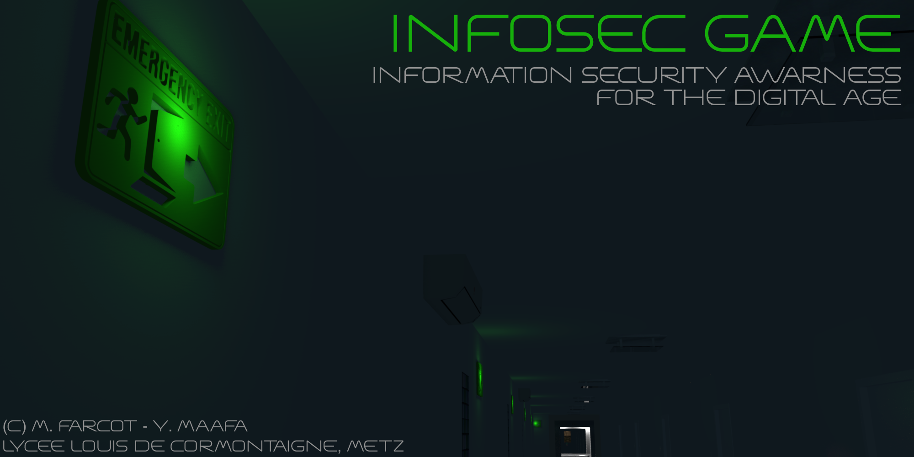
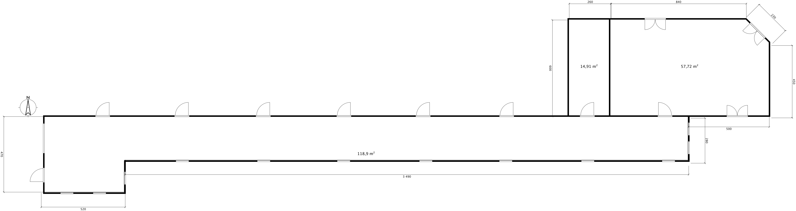

# Infosec Game – Physical Pentest simulator

[Premiers tests sur le serveur en production](https://vr.lycee-cormontaigne-metz.fr/gametest.html)

`Note: Il y a beaucoup de boulot pour l'ambiance et les lumières à faire sur la page A-Frame.... Le but est de coller autant que possible à l'image ci-dessus`

Cadre : Le joueur est employé dans une société de sécurité de l’information opérant chez un client. Le joueur va simuler un « Pentest physique » au sein de cette société virtuelle. Par « Pentest physique », il est entendu une tentative d’intrusion et une identification systématique des risques associés à la sécurité de l’information, en complément des tests réalisés sur l’infrastructure informatique. L’opération est réalisée et menée avec la pleine coopération et sur commande du PDG de l’entreprise, mais pour que l’audit soit efficace, les employés n’ont pas été prévenus.

`Le jeu doit être bilingue français - anglais`

Le jeu se déroule en temps réel, dans un environnement 3D, un peu comme un escape-game. Sur l’écran de jeu, il y a la représentation d’un téléphone portable. Lorsqu’il y a un appel, le pictogramme change de couleur et un bruit de buzzer survient, invitant le joueur à décrocher. Si le joueur clique dessus, il voit un employé lui parler en vidéo.

Le joueur apprend l’objectif de son audit du jour via un autre employé qui l’appelle. Alors qu’il apparait de nuit dans un ascenseur en train de monter, il lui est demandé d’auditer le bureau du manager de l’étage, qui se trouve au fond à droite du couloir. Musique d’ascenseur. On indique au joueur qu’il peut repartir par l’ascenseur une fois qu’il estime que sa mission est terminée.  Le manager s’appelle Mr Jean Dufront. La porte de l’ascenseur s’ouvre. Un long couloir bardé de portes se présente au joueur. La seule lumière vient des fenêtres et des panneaux de sortie d’urgence au plafond, comportant des flèches pointant vers une porte à coté de l’ascenseur.

Le joueur apprend par l’employé que Mr Dufront est parti en vacances. Qu’il vient de poster sur ses réseaux sociaux pleins de photos de sa maison de vacances en indiquant « 2 semaines de repos #zen #Espagne4ever #famillylove». L’employé au téléphone insiste sur le fait que cette publication d’images sur un réseau public représente une certaine insouciance, car il n’y a rien de mieux que de crier au monde que vous n’êtes pas à la maison pendant un certain temps pour se faire cambrioler.

Toutes les portes sont fermées dans le couloir par des digicodes. L’employé indique que le code du bureau de Mr Dufont n’est pas connu, mais que le joueur devra voir pour trouver une solution pour entrer. L’employé invite le joueur à la prudence, car taper un mauvais code entrainerait l’allumage de l’alarme (et la fin du jeu). Les numéros de porte défilent alors que le joueur avance. Le joueur passe devant la seule porte outre le bureau de Mr Dufront qu’il pourra ouvrir en dernière partie du jeu, le bureau 641A . A noter : au milieu du couloir il y a un plan d’évacuation. Tous les bureaux sont identifiés, sauf le 641A, qui semble ne pas exister (la porte n'est pas sur le plan).

Alors qu’il arrive au fond du couloir, une imprimante laser partagée se trouve le long du mur. Si le joueur s’approche de l’imprimante, il verra une page imprimée, marquée « confidentiel », et signée par Mr Dufront. Le contenu relate en termes crus une alerte à destination de la direction sur la perte de chiffre d’affaires de son service et la nécessité pour les employés de réagir au plus vite ou de risquer de se retrouver face à un dégraissage à son retour de vacances. Il inclut aussi un certain nombre de noms d’employés sur lesquels il éstimme qu'il y a des suspicions de manque d’investissement personnel. Un des noms listé est Isabelle P., secrétaire.

Lorsque le joueur clique sur la feuille de l’imprimante, il la prend et peut la lire. Lorsqu’il reclique dessus, une lumière verte s’allume au-dessus de la feuille, indiquant qu’un objet a été trouvé (Objet 1). Le téléphone sonne. L’employé soupire en indiquant qu’il est intéressant de réaliser que cette entreprise ne semble pas connaitre une solution d’impression sécurisé. Il suffirait que les documents imprimés ne soient libérés que lorsque les utilisateurs s’authentifient par mot de passe ou carte magnétique sur l’imprimante, « Mais la Dufront semble en plus pas mal tête en l’air. Quelle idée de laisser un tel document trainer… ».

Après avoir passé l’imprimante, le joueur trouve le bureau numéro 642, porte la plus au fond à droite.

Sur la porte, le joueur trouve un post-it. « Isabelle, je n’ai pas eu le temps de te donner le code mais c’est 1234. Je penserai à toi en vacances. Jean. XXXO ».

L’employé intervient au téléphone pour rire de la quantité de fuites de données sensibles issu de l’usage de post-it. Il mentionne le cas de la fuite de données de TV5 monde, où le mot de passe du compte youtube de la chaine fut piraté car il était écrit sur un post-it dont le contenu était visible lors d’une interview diffusée en direct sur France2 . Il généralise sur la problématique du partage des mots de passe, et des risques que cela fait courir à toute entreprise.

Une lumière verte s’allume devant le post-it (Objet 2).

Le joueur doit taper 1234 sur le digicode. La porte s’ouvre. Une fois ouverte, une lumière verte illumine le digicode (Objet 3). L’employé rappelle le joueur pour indiquer que ce code PIN est le code le plus utilisé au monde  et qu’il devrait être changé.

Le joueur entre dans le bureau. Le bureau est typique pour un cadre d’une grande entreprise (grandes fenêtres, canapé, bureau, poubelle avec à coté un destructeur de documents, PC avec un grand écran, table de réunion, armoire fermée, plante, …).

Le joueur est libre de ses actions une fois dans le bureau.

A noter : Pour trouver les objets le joueur va devoir se déplacer. Il ne peut les voir en une fois.

-	L’écran du PC est allumé et on peut voir que la session est ouverte. Si le joueur clique sur l’écran, une lumière verte s’allume au-dessus de celui-ci. L’employé appelle au téléphone pour parler des risques qu’un ordinateur non bloqué fait planner sur l’entreprise (Objet 4).
-	Une clef USB traine dans le bureau, marquée « urgent ». SI le joueur clique dessus, une lumière verte l’éclaire. Appel de l’employé pour parler de la cause numéro un de la fuite de donnée lié au vol de ce type de petit matériel, mais aussi des risques d’installation d’un logiciel malveillant par un tiers sur la clef (Objet 5).
-	Sous le bureau, sur un meuble à roulette, un livre est plutôt caché. Il s’agit de la « la ferme des animaux » de George Orwell. En cliquant sur le livre, un papier sort. « Code porte 641A : 1634 – Au moins tu pourras utiliser le frigo, signé Jules ». Ce code sera utile pour activer l’easter-egg. Pas de lumière verte liée à cette action.
-	Dans la poubelle, un mot froissé. « Tu m’avais dit que ces vacances on partirait ensemble. Tu n’es qu’un lâche. Tu m’avais dit que tu quitterais ta femme. J’en ai marre de tes mensonges. Signé Isa ».  Lumière verte. Appel de l’employé « Oulah… ça devient perso là. Et en plus il avait juste à utiliser son destructeur de document.  Tu parles d’une info sensible pouvant devenir un moyen de pression énorme ! On nage en plein Ashley madison !» (Objet 6)
-	Sur le canapé un smartphone. Une flèche invite à débloquer le smartphone sur l’écran, mais il n’y a pas de Pin Code demandé après cette action. L’écran se débloque directement. 20 appels manqués, tous du même numéro, contact « Isa P. ». Lumière verte sur le smartphone. L’employé appelle : « Là c’est un risque frontal pour l’entreprise en termes de risque d’usurpation d’identité. On nage en plein délire… pourquoi avoir enlevé le code de verrouillage ? » (Objet 7)
-	L’armoire fermée n’est pas fermée à clef. Si le joueur clique sur l’armoire, elle s’ouvre, laissant entrapercevoir plein de dossiers marqués « Confidentiel ». Lumière verte si le joueur clique sur l’un d’eux. Appel de l’employé : « Je ne crois pas qu’on devrait si facilement avoir accès à tous ces dossiers ». (Objet 8)
-	Un disque dur externe est relié par câble USB à l’unité centrale. Le disque est marqué « sauvegarde ». Lumière verte si l’objet est cliqué. Appel de l’employé : « Pour une personne malintentionnée c’est beaucoup plus facile de partir avec ça qu’avec une unité centrale sous le bras… » (Objet 9)
-	Option (?) Un ordinateur portable est fermé sur une étagère. Le joueur le prend. Un clique= ouverture. 2eme clique= écran avec ransomware. Appel de l'employé : « C'est son laptop. C'est son problème. Heureusement que cet ordinateur n'a pas un accès au réseau local ». Lumière verte sur le portable. (Objet 10 - si validation)
-	Option (?) Une feuille marquée « Personnel et Confidentiel » écrite à la main et signée par Mr Dufront est dans le trieur sur son bureau.  Son contenu : «Jules. Je n'en ai rien à foutre que notre politique de sécurité nous empèche de faire tourner tout ce qu'on veut au niveau IT. Concrétement, je te donne par la présente l'ordre d'ouvrir les ports 445 et 3389 de notre firewall pour permettre à mon équipe de faire son boulot. Tu es prévenu. Si tu ne le fais pas ça remontera en conseil de direction. J'ai suffisement de casseroles pour vous faire virer toi et ton équipe de bras cassés ». Appel de l'employé : « Ca c'est plutot classique. Mettre en danger tout un système d'information pour les intérêts d'un service interne, avec une prise de décision d'un Manager narcissique qui n'hésite pas à faire du chantage. J'adore! ». Lumière verte sur la feuille. (Objet 11 - si validation)

## Easter-Egg, la salle 341A :
Si le joueur fais usage du code trouvé dans le bureau (livre d’orwell) et tape le bon code, Il peut y rentrer. Il trouvera une salle serveur, avec des posters au mur (Babar, Casper , …). Il y a un petit frigo. Si le joueur clique sur le frigo, il l’ouvre. A l’intérieur, il se trouve le nain mascotte de Cor’Lab. Si le joueur clique dessus, une lumière type boule disco s’allume dessus (Objet Bonus, musique Trollolo). Appel de l’employé : « Je ne suis pas autorisé à te parler de ce qui se trouve ou se passe dans cette pièce. Mais j’adore le nain ! ».

# Fin du jeu :
A tout moment , le joueur peut quitter le jeu en entrant dans l’ascenseur. Il a alors plusieurs indications qui s’affichent :
-	Le temps de jeu
-	Le pourcentage d’objets identifiés (X/9 ou 10 ou 11)
- Une liste des objets/risques trouvés, avec une partie complémentaire et pédagogique « remédiation » incluant des bonnes pratiques. Par contre pas de remédiation pour les objets non trouvés.
-	Bonus si le nain est trouvé
-	Le joueur se voit attribuer des badges :
    -	« Employé du mois » si 100% des objets sont trouvés
    -	« Les feux de l’amour » si la feuille de l’imprimante, la note du papier froissé dans la poubelle, et le téléphone sont trouvés
    -	« InfoSec Guru » si le nain est trouvé dans la salle 641A.
    -	« Bonnet d'âne » si un mauvais code est utilisé sur un des digicode. L'alarme se lance, Le tel sonne, l'employé dit "non mais sérieux??", et le jeu quitte. OU le joueur commence le jeu, sort de l'ascenseur, et y retourne directement.
 
# Ressources
Afin de transformer ce jeu en un outil pédagogique, il est important d'établir [des liens avec le referentiel CIEL](https://eduscol.education.fr/referentiels-professionnels/Bac_Pro_CIEL/Annexes_Bac_Pro_CIEL230213.pdf).

Ce jeu s'inscrit dans le cadre de la nouvelle Unité 32 « Valorisation de la donnée et cybersécurité » du Bac Pro CIEL (communication et analyse - en particulier pour l'activité D3 – Gestion d’incidents), mais étant disponnible aussi en anglais, il s'inscrit aussi dans l'Unité 4 « Langue vivante » (compréhension orale et écrite).

# Remédiations
|Objet n°|Nature du risque|Remédiation|
|---|---|---|
|1|Fuite de données - perte d'intégrité de la confidentialité d'un document via un oubli sur une imprimante partagée|Contrôle d'accès et de l'impression, formation du personnel|
|2|Fuite de données - affichage public du mot de passe|Formation du personnel|
|3|Faille de sécurité - usage de mots de passe faibles|Amélioration du système de contrôle d'accès pour refuser les mots de passe faibles|
|4|Faille de sécurité - ordinateur non verouillé|Blocage automatique après 5 minutes|
|5|Fuite de données et Faille de sécurité - clef USB accessible donc ports USB actifs|Mise à dispotion de meubles qui se ferment à clef, formation du personnel, blocage des ports USB du PC|
|6|Fuite de données - données sensibles non détruites|Mise à disposition d'un destructeur de documents, formation du personnel|
|7|Fuite de données et Faille de sécurité - téléphone non bloqué|Mise à dispotion de meubles qui se ferment à clef, formation du personnel, amélioration du système de contrôle d'accès|
|8|Fuite de données - meuble avec serrure non fermé à clef|Formation du personnel|
|9|Fuite de données et Faille de sécurité - disque dur externe USB accessible pour les sauvegardes donc (?) ports USB actifs|Sauvegarde via cloud interne uniquement, blocage des ports USB du PC|
|10?|Faille de sécurité - ordinateur portable personnel avec ransomware|Politique anti BYOD (Bring Your Own ~~Device~~ Disaster), formation du personnel|
|11?|Faille de sécurité - ordre de mauvaise configuration du part-feu (firewall)|Politique de sécurité, indépendance décisionnelle de l'équipe technique, formation du personnel|

