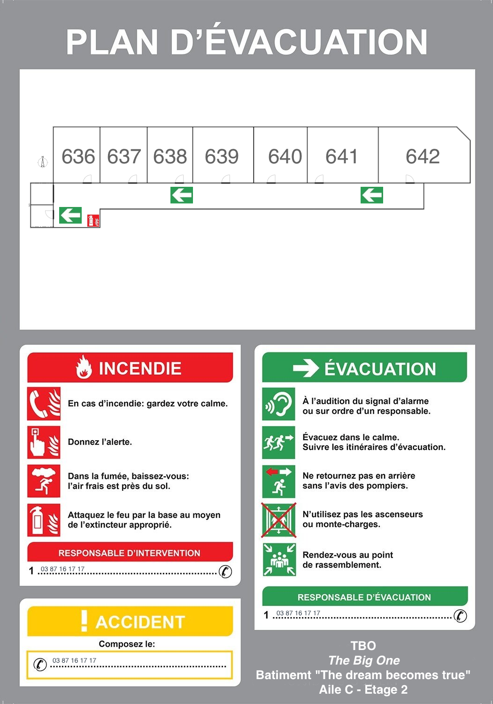

# Infosec Game – Physical Pentest simulator

[Premiers tests sur le serveur en production](https://vr.lycee-cormontaigne-metz.fr/gametest.html)

`Note: Il y a beaucoup de boulot pour l'ambiance et les lumières à faire sur la page A-Frame.... Le but est de coller autant que possible à l'image ci-dessus (ambiance obscure, inquiétante, cadre réaliste). Manque aussi 4 NavMesh pour limiter les déplacements du joueurs en fonction des phases de jeux : (1) Zone ascenseur (Début et Fin de jeu) | (2) Zone couloir | (3) Zone bureau 642 | (4) Zone 641A`

## Objectif du projet
Créer une application Web en 3D, exploitable sur différentes plate-formes (PC, smartphones, casques VR) sans nécéssiter de téléchargement d'applications tierces pour sensibiliser à la sécurité de l'information. Si le scénario concerne le cas d'une entreprise, les différents éléments soulevés doivent pouvoir s'appliquer au grand public. Pour être utilisée, seul un navigateur compatible doit être  nécéssaire, et aucun cookie ou traceur ne sera déployé. L'expérience doit être la plus ludique possible, afin d'optimiser son coté pédagogique. Elle doit inclure de multiples références à des risques ou des faits relatifs à la sécurité de l'information dans ses aspects techniques ou normatifs permettant de devenir un support pédagogique exploitable dans un cadre plus large. Le niveau requis pour la compréhension de l'ensemble des concepts par un joueur est la première année de lycée en Bac Pro CIEL. Le jeu doit être proposé et utilisable en deux langues, anglais et français.

Le support, le scénario, le code et tous les éléments graphiques doivent être [sous licence AFFERO GPL v3](https://fr.wikipedia.org/wiki/GNU_Affero_General_Public_License).

## Auteurs
- Matthieu Farcot
- Yanis Maafa (élève de terminale en Bac PRO SSIHT, stagiaire)

## Cadre
Le joueur est employé dans une société de sécurité de l’information nommée **Explicitely Identifiable** ("EI"). Cette société propose de multiples services dont la réalisation d'audits en vue de l'obtention d'une [certification ISO/CEI 27000](https://fr.wikipedia.org/wiki/ISO/CEI_27000). Dans le cadre de ce processus de certification abordant la gestion de la sécurité de l'information et la mise en oeuvre des bonnes pratiques liées, le joueur va réaliser un "Pentest physique" au sein d'une société virtuelle cliente nommée **TBO** (pour The Big One). Par "Pentest physique", il est entendu une tentative d’intrusion et une identification systématique des risques associés à la sécurité de l’information, en complément des tests réalisés sur l’infrastructure informatique qui ne seront pas abordés directement dans le jeu (mais auquel il sera fait mention à de multiples occasions). L’opération est réalisée et menée avec la pleine coopération et sur commande du PDG et du conseil d'administration de TBO, mais pour que l’audit soit efficace, les employés n’ont pas été prévenus.

Il va être demandé au joueur de se concentrer sur les activités et les pratiques en matière de sécurité de l'information d'un employé précis, le directeur de la branche marketing de la société TBO qui vient de partir pour 2 semaines en vacances. Dans le cadre de sa progression, le joueur va vite réaliser que de nombreuses mauvaises pratiques sont mises en oeuvre. Afin de rendre l'aventure plus ludique, le joueur aura aussi l'occasion de trouver des details personnels sur la vie de ce directeur. A chaque découverte, le joueur va être mis en relation par téléphone avec un employé de EI qui suit les activités du joueur via une caméra embarquée.
Ces interventions seront l'occasion de caractériser les risques concernés.

Un easter-egg permettra d'élargir la problématique s'il est découvert. TBO possède en effet une pièce cachée dédiée à l'écoute et la surveillance pour le compte d'une agence gouvernementale. Toute ressemblance avec des faits existants ou [ayant existé](https://fr.wikipedia.org/wiki/Room_641A) serait presque purement fortuite.

A la fin du jeu, le joueur a accès à ses statistiques de réalisation et se voit décerner des badges en fonction de ses actions. Ces badges seront l'occasion de revenir sur les bonnes pratiques.

## Scenario

### Plan du jeu

Le plan est simple. A l'ouest, un ascenseur par lequel arrive et repart le joueur. A l'est, deux bureaux. Le plus à droite (numéro 642) est le bureau du directeur. Juste avant une porte permet de rentrer dans un petit bureau sans fenêtre identifié par le numéro 641A.

### Interface
Le jeu se déroule en temps réel, dans un environnement 3D. Sur l’écran de jeu, il y a la représentation d’un téléphone portable. Lorsqu’il y a un appel, le pictogramme change de couleur et un bruit de buzzer survient, invitant le joueur à décrocher. Si le joueur clique dessus, il voit un employé lui parler en vidéo.

### Histoire
Le jeu commence dans un ascenseur, occasion d'apprécier une musique dédiée et de faire passer un court générique. Le téléphone sonne à la fin du générique. Un employé de EI intervient en vidéo.

|Texte français|Texte anglais|
|---|---|
|Salut. Prêt pour l'operation PenTest? Je rigole. Tu n'as pas le choix. Ok. Je branche la caméra. Le flux vidéo est stable. Tu n'es plus tout seul. Comme convenu, personne dans l'entreprise n'est au courant de notre passage, donc évite de te faire remarquer. Tous les bureaux sont fermés par digicode. Et en cas de mauvais code, l'alarme se lance, donc évite. Tu repartiras à la fin par ce même ascenseur. Le bureau qui nous interresse est au fond à gauche. Tu devrais être tout seul dans les locaux car les employés sont partis, mais fais quand même gaffe aux caméras. Tu connais ta mission. Identifie tout ce qui est un risque en matière de sécurité de l'information. L'heureux gagnant de l'opération du jour est un certain Mr Dufront, le directeur marketing de TBO, qui ne semble pas avoir que des copains dans cette boite. Il est le père de trois enfants. J'ai ses comptes de réseaux sociaux publics en ligne si ça t'interresse. Et il vient de publier sur sa page Facebook des photos du village vacance ou il est partit avec sa famille en précisant bien que c'était pour deux semaines. Ca permet déjà de cerner un peu le personnage. Je n'ai jamais pu comprendre le besoin de certains de vouloir crier publiquement au monde qu'on ne sera pas à la maison pendant un certain temps juste pour satisfaire une pulsion narcissique. Rien de mieux pour attirer des cambrioleurs. Bref *soupir*. Ce n'est pas dans le cadre de l'audit. Au fait... je n'ai pas le code du bureau de notre directeur, mais je suis sûr que tu trouveras une solution.| Hello. Ready for the PenTest operation? I’m kidding. You don’t have a choice. Okay. I’m connecting the camera. The video feed is stable. You’re no longer alone. As agreed, no one in the company is aware of our presence, so avoid drawing attention to yourself. All offices are secured with access codes. And if you enter the wrong code, the alarm will activate, so be cautious. You’ll exit through the same elevator at the end. The office we’re interested in is at the far left. You should be alone in the premises since the employees have left, but still, watch out for cameras. You know your mission. Identify any information security risks. Today’s lucky target is a certain Mr. Dufront, the marketing director at TBO, who doesn’t seem to have many friends in this company. He’s a father of three. I have his publicly available social media accounts if you’re interested. And he just posted photos on his Facebook page from the vacation village where he went with his family, clearly stating it was for two weeks. That already gives us some insight into his character. I’ve never understood the need for some people to publicly announce that they won’t be home for a certain period, just to satisfy their narcissistic impulses. Nothing better to attract burglars. Anyway, sigh, this isn’t part of the audit. By the way… I don’t have the code for the director’s office, but I’m sure you’ll find a solution.|

Les portes de l'ascenseur s'ouvrent. Un long couloir bardé de 8 portes se présente au joueur. La seule faible lumière vient de l'exterieur par des fenêtres et des panneaux de sortie d’urgence au plafond. Les panneaux comportent des flèches pointant vers une porte à coté de l’ascenseur. Sur le palier se trouve un extincteur.

Dans le couloir , toutes les portes des bureaux (à l'exception de la sortie de secours) sont fermées par des digicodes. Les numéros de porte défilent alors que le joueur avance. Le premier bureau à la sprtie de l'ascenseur est le 635. Ils se suivent jusqu'à une duplication du 641 qui est le 641A. Au milieu du couloir il y a un plan d’évacuation. Tous les bureaux sont identifiés, sauf le 641A, qui semble ne pas exister (la porte n'est pas sur le plan).

Alors qu’il arrive au fond du couloir, une imprimante laser partagée se trouve le long du mur. Si le joueur s’approche de l’imprimante, il verra une page imprimée, signée par Mr Dufront, et datée de la veille. 

Lorsque le joueur clique sur la feuille de l’imprimante, il la prend (affichage plein écran si navigation sur un écran, ou rattaché à une manette en VR).

|Texte français|Texte anglais|
|---|---|
|Confidentiel. À destination du comité de direction. Je suis conscient de l’effet initial que va avoir l’annonce du plan social sur le moral des troupes, mais il n’y a rien de mieux qu’un électrochoc pour motiver les employés. Donc, pour le dégraissage du mammouth, je me propose de vous transmettre une liste de quelques employés qui sont, à mes yeux, dispensables dans mon service. J’en vois trois en particulier : ma secrétaire Isabelle P., le graphiste Thierry A. et le responsable de notre présence en ligne, Albert F. Cela permettra aux 80 % qui resteront de saisir l’occasion et d’arrêter de nous importuner avec le télétravail. Merci en tout cas d'attendre mon retour de vacances avant toute annonce publique, sachant que les syndicats vont sans doute se reveiller. Cordialement, M. Dufront, Directeur Marketing | Confidential. For the attention of the executive committee. I am aware of the initial impact that the announcement of the social plan will have on morale, but there is nothing better than a shock to motivate employees. Therefore, for streamlining the organization, I propose to provide you with a list of a few employees who, in my view, are dispensable in my department. I specifically identify three: my secretary Isabelle P., the graphic designer Thierry A., and the person responsible for our online presence, Albert F. This will allow the remaining 80% to seize the opportunity and stop bothering us with remote work. Thank you, in any case, for waiting until I return from vacation before making any public announcements, as the unions are likely to wake up. Sincerely, Mr. Dufront, Marketing Director|

Après l'avoir lue, lorsqu’il reclique dessus, la feuille revient à sa place d'origine, et une une lumière rouge s’allume au-dessus de la feuille, indiquant qu’un objet a été trouvé (**Objet 1**). Le téléphone sonne.

L’employé soupire en indiquant qu’il est intéressant de réaliser que cette entreprise ne semble pas connaitre une solution d’impression sécurisé. Il suffirait que les documents imprimés ne soient libérés que lorsque les utilisateurs s’authentifient par mot de passe ou carte magnétique sur l’imprimante, « Mais la Dufront semble en plus pas mal tête en l’air. Quelle idée de laisser un tel document trainer… ».

Après avoir passé l’imprimante, le joueur trouve le bureau numéro 642, porte la plus au fond à droite.

Sur la porte, le joueur trouve un post-it. « Isabelle, je n’ai pas eu le temps de te donner le code mais c’est 1234. Je penserai à toi en vacances. Jean. XXXO ».

L’employé intervient au téléphone pour rire de la quantité de fuites de données sensibles issu de l’usage de post-it. Il mentionne le cas de la fuite de données de TV5 monde, où le mot de passe du compte youtube de la chaine fut piraté car il était écrit sur un post-it dont le contenu était visible lors d’une interview diffusée en direct sur France2 . Il généralise sur la problématique du partage des mots de passe, et des risques que cela fait courir à toute entreprise.

Une lumière verte s’allume devant le post-it (Objet 2).

Le joueur doit taper 1234 sur le digicode. La porte s’ouvre. Une fois ouverte, une lumière verte illumine le digicode (Objet 3). L’employé rappelle le joueur pour indiquer que ce code PIN est le code le plus utilisé au monde  et qu’il devrait être changé.

Le joueur entre dans le bureau. Le bureau est typique pour un cadre d’une grande entreprise (grandes fenêtres, canapé, bureau, poubelle avec à coté un destructeur de documents, PC avec un grand écran, table de réunion, armoire fermée, plante, …).

Le joueur est libre de ses actions une fois dans le bureau.

A noter : Pour trouver les objets le joueur va devoir se déplacer. Il ne peut les voir en une fois.

-	L’écran du PC est allumé et on peut voir que la session est ouverte. Si le joueur clique sur l’écran, une lumière verte s’allume au-dessus de celui-ci. L’employé appelle au téléphone pour parler des risques qu’un ordinateur non bloqué fait planner sur l’entreprise (Objet 4).
-	Une clef USB traine dans le bureau, marquée « urgent ». SI le joueur clique dessus, une lumière verte l’éclaire. Appel de l’employé pour parler de la cause numéro un de la fuite de donnée lié au vol de ce type de petit matériel, mais aussi des risques d’installation d’un logiciel malveillant par un tiers sur la clef (Objet 5).
-	Sous le bureau, sur un meuble à roulette, un livre est plutôt caché. Il s’agit de la « la ferme des animaux » de George Orwell. En cliquant sur le livre, un papier sort. « Code porte 641A : 1634 – Au moins tu pourras utiliser le frigo, signé Jules ». Ce code sera utile pour activer l’easter-egg. Pas de lumière verte liée à cette action.
-	Dans la poubelle, un mot froissé. « Tu m’avais dit que ces vacances on partirait ensemble. Tu n’es qu’un lâche. Tu m’avais dit que tu quitterais ta femme. J’en ai marre de tes mensonges. Signé Isa ».  Lumière verte. Appel de l’employé « Oulah… ça devient perso là. Et en plus il avait juste à utiliser son destructeur de document.  Tu parles d’une info sensible pouvant devenir un moyen de pression énorme ! On nage en plein Ashley madison !» (Objet 6)
-	Sur le canapé un smartphone. Une flèche invite à débloquer le smartphone sur l’écran, mais il n’y a pas de Pin Code demandé après cette action. L’écran se débloque directement. 20 appels manqués, tous du même numéro, contact « Isa P. ». Lumière verte sur le smartphone. L’employé appelle : « Là c’est un risque frontal pour l’entreprise en termes de risque d’usurpation d’identité. On nage en plein délire… pourquoi avoir enlevé le code de verrouillage ? » (Objet 7)
-	L’armoire fermée n’est pas fermée à clef. Si le joueur clique sur l’armoire, elle s’ouvre, laissant entrapercevoir plein de dossiers marqués « Confidentiel ». Lumière verte si le joueur clique sur l’un d’eux. Appel de l’employé : « Je ne crois pas qu’on devrait si facilement avoir accès à tous ces dossiers ». (Objet 8)
-	Un disque dur externe est relié par câble USB à l’unité centrale. Le disque est marqué « sauvegarde ». Lumière verte si l’objet est cliqué. Appel de l’employé : « Pour une personne malintentionnée c’est beaucoup plus facile de partir avec ça qu’avec une unité centrale sous le bras… » (Objet 9)
-	Option (?) Un ordinateur portable est fermé sur une étagère. Le joueur le prend. Un clique= ouverture. 2eme clique= écran avec ransomware. Appel de l'employé : « C'est son laptop. C'est son problème. Heureusement que cet ordinateur n'a pas un accès au réseau local ». Lumière verte sur le portable. (Objet 10 - si validation)
-	Option (?) Une feuille marquée « Personnel et Confidentiel » écrite à la main et signée par Mr Dufront est dans le trieur sur son bureau.  Son contenu : « Jules. Je n'en ai rien à foutre que notre politique de sécurité nous empèche de faire tourner tout ce qu'on veut au niveau IT. Concrétement, je te donne par la présente l'ordre d'ouvrir les ports 445 et 3389 de notre firewall pour permettre à mon équipe de faire son boulot. Tu es prévenu. Si tu ne le fais pas ça remontera en conseil de direction. J'ai suffisement de casseroles pour vous faire virer toi et ton équipe de bras cassés ». Appel de l'employé : « Ca c'est plutot classique. Mettre en danger tout un système d'information pour les intérêts d'un service interne, avec une prise de décision d'un Manager narcissique qui n'hésite pas à faire du chantage. J'adore! ». Lumière verte sur la feuille. (Objet 11 - si validation)

## Easter-Egg, la salle 341A :
Si le joueur fais usage du code trouvé dans le bureau (livre d’orwell) et tape le bon code, Il peut y rentrer. Il trouvera une salle serveur, avec des posters au mur (Babar, Casper , …). Il y a un petit frigo. Si le joueur clique sur le frigo, il l’ouvre. A l’intérieur, il se trouve le nain mascotte de Cor’Lab. Si le joueur clique dessus, une lumière type boule disco s’allume dessus (Objet Bonus, musique Trollolo). Appel de l’employé : « Je ne suis pas autorisé à te parler de ce qui se trouve ou se passe dans cette pièce. Mais j’adore le nain ! ».

# Fin du jeu :
A tout moment , le joueur peut quitter le jeu en entrant dans l’ascenseur. Il a alors plusieurs indications qui s’affichent :
-	Le temps de jeu
-	Le pourcentage d’objets identifiés (X/9 ou 10 ou 11)
- Une liste des objets/risques trouvés, avec une partie complémentaire et pédagogique « remédiation » incluant des bonnes pratiques. Par contre pas de remédiation pour les objets non trouvés.
-	Bonus si le nain est trouvé
-	Le joueur se voit attribuer des badges :
    -	« Employé du mois » si 100% des objets sont trouvés
    -	« Les feux de l’amour » si la feuille de l’imprimante, la note du papier froissé dans la poubelle, et le téléphone sont trouvés
    -	« InfoSec Guru » si le nain est trouvé dans la salle 641A.
    -	« Bonnet d'âne » si un mauvais code est utilisé sur un des digicode. L'alarme se lance, Le tel sonne, l'employé dit "non mais sérieux??", et le jeu quitte. OU le joueur commence le jeu, sort de l'ascenseur, et y retourne directement.
 
# Ressources
Afin de transformer ce jeu en un outil pédagogique, il est important d'établir [des liens avec le referentiel CIEL](https://eduscol.education.fr/referentiels-professionnels/Bac_Pro_CIEL/Annexes_Bac_Pro_CIEL230213.pdf).

Ce jeu s'inscrit dans le cadre de la nouvelle Unité 32 « Valorisation de la donnée et cybersécurité » du Bac Pro CIEL (communication et analyse - en particulier pour l'activité D3 – Gestion d’incidents), mais étant disponnible aussi en anglais, il s'inscrit aussi dans l'Unité 4 « Langue vivante » (compréhension orale et écrite).

# Remédiations
|Objet n°|Nature du risque|Remédiation|
|---|---|---|
|1|Fuite de données - perte d'intégrité de la confidentialité d'un document via un oubli sur une imprimante partagée|Contrôle d'accès et de l'impression, formation du personnel|
|2|Fuite de données - affichage public du mot de passe|Formation du personnel|
|3|Faille de sécurité - usage de mots de passe faibles|Amélioration du système de contrôle d'accès pour refuser les mots de passe faibles|
|4|Faille de sécurité - ordinateur non verrouillé|Verrouillage automatique du PC après 5 minutes non modifiable par l'utilisateur|
|5|Fuite de données et Faille de sécurité - clef USB accessible donc ports USB actifs|Mise à dispotion de meubles qui se ferment à clef, formation du personnel, blocage des ports USB du PC|
|6|Fuite de données - données sensibles non détruites|Mise à disposition d'un destructeur de documents, formation du personnel|
|7|Fuite de données et Faille de sécurité - téléphone non bloqué|Mise à dispotion de meubles qui se ferment à clef, formation du personnel, amélioration du système de contrôle d'accès|
|8|Fuite de données - meuble avec serrure non fermé à clef|Formation du personnel|
|9|Fuite de données et Faille de sécurité - disque dur externe USB accessible pour les sauvegardes donc (?) ports USB actifs|Sauvegarde via cloud interne uniquement, blocage des ports USB du PC|
|10?|Faille de sécurité - ordinateur portable personnel avec ransomware|Politique anti BYOD (Bring Your Own ~~Device~~ Disaster), formation du personnel|
|11?|Faille de sécurité - ordre de mauvaise configuration du part-feu (firewall)|Politique de sécurité, indépendance décisionnelle de l'équipe technique, formation du personnel|

Importance du processus de certification ISO 27000 donné en introduction. Permettre une discussion/reflexion des utilisateurs sur le lien entre les aspects techniques et normatifs de la sécurité de l'information sera un des résultats de cette experience. Il **faut** inclure des liens vers une politique de sécurité, tout en insistant sur les limites du cadre normatif et de l'impact de la résistance au changement.

